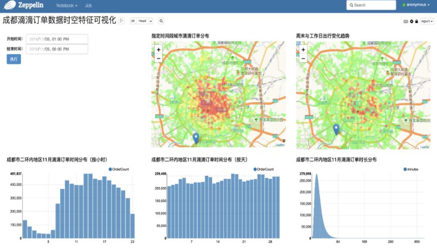
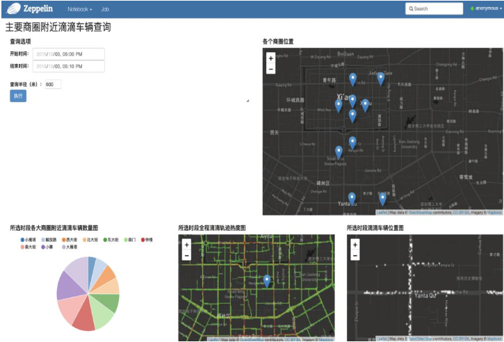

# GeoVizApp
使用GeoSpark + Zeppelin对滴滴轨迹数据可视化

## 数据

来源滴滴盖亚计划 https://gaia.didichuxing.com 

成都订单数据来自：”2016年11月成都市二环局部区域轨迹数据“

西安轨迹数据来自：“2016年10月西安市二环局部区域轨迹数据”

## 环境配置

1. Zeppelin Version 0.9.0-preview1

2. Spark 2.3.0

3. 下载GeoSpark pre-compiled JARs 1.3.1

   https://github.com/DataSystemsLab/GeoSpark/releases

4. 下载GeoSpark源码

   https://github.com/jiayuasu/GeoSpark

5. 按照以下步骤安装Geospark-Zeppelin

   https://datasystemslab.github.io/GeoSpark/download/zeppelin/

   * 在创建**geospark-zeppelin.json**时，artifact属性后的地址更改为GeoSpark源码中zeppelin文件夹的位置。
   * Dependencies中添加对应JARS位置

## 运行

### 官方示例

https://datasystemslab.github.io/GeoSpark/tutorial/zeppelin/

### 滴滴轨迹可视化应用

​	为方便运行代码中数据为直接从本地读取，也可根据需求配置分布式存储

1. zeppelin中import对应zpln文件
2. 将原始数据合并为一个文件，并修改代码中路径
3. 运行

## 可视化工具说明

​	修改GeoSpark/zeppelin中的index.js可以改变可视化效果，如对国内标准和国际标准GPS坐标进行转换，更改地图风格等，repo中的zeppelin文件夹包含了这些简单修改。

## 参考

* GeoSpark文档

  https://datasystemslab.github.io/GeoSpark/

* Zeppelin文档

  https://zeppelin.apache.org/

